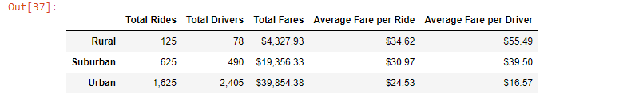

# PyBer Analysis of Rural, Suburban, and Urban Data, and a Highlight of Jan - Apr 2019 Data
Upon completion of our initial project, V. Isualize has requested that we highlight data from rural, suburban, and urban ride-sharing. Specifically, she would like Total Rides, Drivers, Fares, and Averages highlighted for each. After retrieving each, I will create a line graph to highlight the data on a week to week basis from January 1st to April 28th, 2019.
## The Results
From the data, we can make multiple conclusions about ride_sharing in rural, suburban, and urban cities:
1. There are significantly more urban rides, with rural having the lowest (13x higher)
2. There are significantly more drivers in urban cities, with rural having the least (30x higher)
3. Urban cities generated significantly more fares, with rural generating the least (9x higher)
4. Rural cities had the highest average fare per ride, with urban being the lowest (1.4x higher)
5. Rural cities had the highest average fare per driver, with urban being the lowest (3.3x higher)
6. As shown by the graph, urban generating the most fares, suburban the second most, and rural the least is always true. From best to worst in fare generation, the order is always: urban, suburban, rural.
Each of these conclusions can be seen clearly on the table and graph below.

## Summary
From these results, we can adjust or implament business decisions to better capitalize on better performing cities.
1. With inherent limitations of rural cities, I do not believe it would be a wise strategy to orient a growth strategy around rural cities, at least until rural cities show more intest in ride-sharing. That said, there is clearly higher fares in rural areas, and more rides than drivers. PyBer could run a promotion to temporarily offer incentives to bring in more drivers and temporarily reduce ride prices to build up a customer base. If both of these could happen, the rural cities could bring in significantly more revenue.
2. On the opposite end of the spectrum, urban cities performed well, but there is room for growth. In urban cities, there were more drivers than rides. In this case, it would be better for PyBer to limit the number of drivers. Limiting drivers would raise both the average fare per ride and driver, while maintaining an acceptable amount of drivers to keep riders interested.
3. Finally, a marriage of these two strategies could be implemented in suburban cities. The number of drivers should be slightly increased, and PyBer could explore a small promotion to temporarily reduce ride prices to attract more riders.

The idea behind this strategy is to:
- Increase/decrease the number of drivers to the number of rides needed. This maintains an acceptable number of drivers to keep ride-sharing reliable, while not oversaturating the driver pool and making drivers compete amongst themselves for fares, which hurts the average fare per ride and driver.
- Keep riders interested in ride-sharing. The service not only needs to be reliable (this potentially hurt rural and suburban performance), but it also needs to be affordable. Reliability will retain current customers, and promotions and lower fares will bring in new customers.

With these things in mind, PyBer could make slight adjustments and see better performance from all three city types moving forward.
